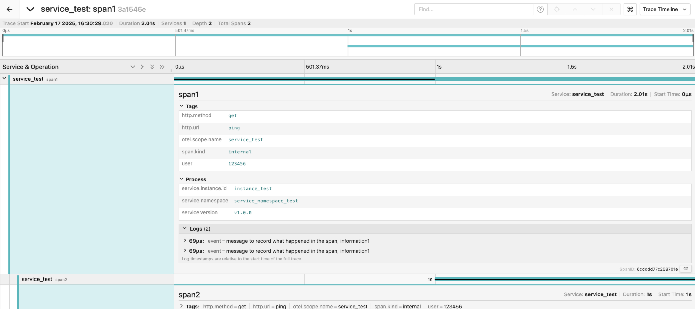

## go-web-template trace

在docker中启动jaeger：

```shell
docker run -d --name jaeger \
  -e COLLECTOR_OTLP_ENABLED=true \
  -p 16686:16686 \
  -p 4317:4317 \
  -p 4318:4318 \
  jaegertracing/all-in-one:latest
```

**WebUI：** http://127.0.0.1:16686/
**GRPC接口：** http://127.0.0.1:4317/
**HTTP接口：** http://127.0.0.1:4318/

测试代码中的trace信息如下：



原数据如下

```json
{
  "data": [
    {
      "traceID": "3a1546e34ced261ab0fdf855e84f6f05",
      "spans": [
        {
          "traceID": "3a1546e34ced261ab0fdf855e84f6f05",
          "spanID": "13288b12e6b65694",
          "operationName": "span2",
          "references": [
            {
              "refType": "CHILD_OF",
              "traceID": "3a1546e34ced261ab0fdf855e84f6f05",
              "spanID": "6cdddd77c258701e"
            }
          ],
          "startTime": 1739781030021922,
          "duration": 1004206,
          "tags": [
            {
              "key": "http.method",
              "type": "string",
              "value": "get"
            },
            {
              "key": "http.url",
              "type": "string",
              "value": "ping"
            },
            {
              "key": "otel.scope.name",
              "type": "string",
              "value": "service_test"
            },
            {
              "key": "span.kind",
              "type": "string",
              "value": "internal"
            },
            {
              "key": "user",
              "type": "string",
              "value": "123456"
            }
          ],
          "logs": [],
          "processID": "p1",
          "warnings": null
        },
        {
          "traceID": "3a1546e34ced261ab0fdf855e84f6f05",
          "spanID": "6cdddd77c258701e",
          "operationName": "span1",
          "references": [],
          "startTime": 1739781029020681,
          "duration": 2005465,
          "tags": [
            {
              "key": "http.method",
              "type": "string",
              "value": "get"
            },
            {
              "key": "http.url",
              "type": "string",
              "value": "ping"
            },
            {
              "key": "otel.scope.name",
              "type": "string",
              "value": "service_test"
            },
            {
              "key": "span.kind",
              "type": "string",
              "value": "internal"
            },
            {
              "key": "user",
              "type": "string",
              "value": "123456"
            }
          ],
          "logs": [
            {
              "timestamp": 1739781029020750,
              "fields": [
                {
                  "key": "event",
                  "type": "string",
                  "value": "message to record what happened in the span, information1"
                }
              ]
            },
            {
              "timestamp": 1739781029020750,
              "fields": [
                {
                  "key": "event",
                  "type": "string",
                  "value": "message to record what happened in the span, information1"
                }
              ]
            }
          ],
          "processID": "p1",
          "warnings": null
        }
      ],
      "processes": {
        "p1": {
          "serviceName": "service_test",
          "tags": [
            {
              "key": "service.instance.id",
              "type": "string",
              "value": "instance_test"
            },
            {
              "key": "service.namespace",
              "type": "string",
              "value": "service_namespace_test"
            },
            {
              "key": "service.version",
              "type": "string",
              "value": "v1.0.0"
            }
          ]
        }
      },
      "warnings": null
    }
  ],
  "total": 0,
  "limit": 0,
  "offset": 0,
  "errors": null
}
```
